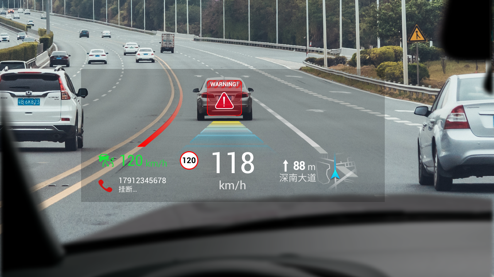

<h1 align=center font-weight:100>AR-HUD-Simulation-Platform</h1>

    <h3 align="center"><a href="https://argalia2017.github.io/AR-HUD-Simulation-Platform/">Project Page</a> </h3>
  

This is a demo of AR-HUD,used for developing the AR engine indoors.

  

## TODO
- [ ] Rewrite code

## Acknowledgments

This project is fork from [Academic-project-page-template](https://github.com/eliahuhorwitz/Academic-project-page-template)